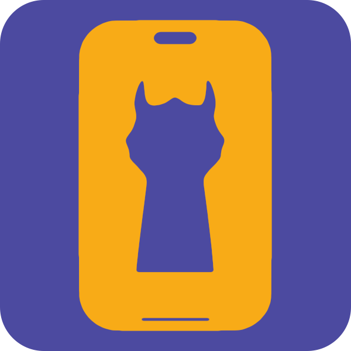
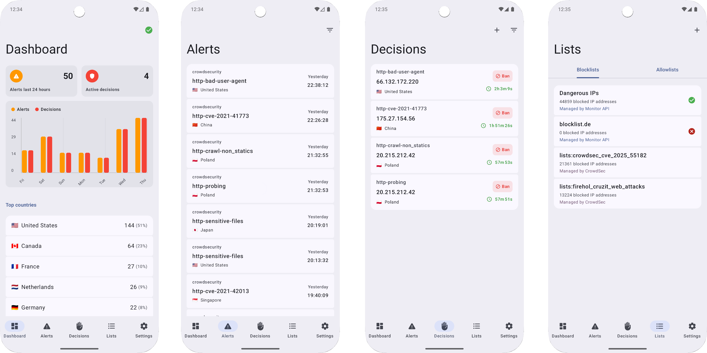

  

  <h1>CrowdSec Monitor</h1>
  

    CrowdSec Monitor is an application for Android that allows you to check the statistics and values of your CrowdSec instance. It's built with Kotlin and Jetpack Compose for good performance, and follows the Material 3 Expressive design guidelines provided by Google.
  

   
  

  
  

## Required API
CrowdSec Monitor gets it's data from an intermediate API between the app and CrowdSec's LAPI. This API caches the data and offers it with more filtering options. In order to use this app, you have to deploy this API next to your CrowdSec instance, on the same machine.

This API is available [here](https://github.com/JGeek00/crowdsec-monitor-api).

## Disclaimer
This is a third party software that is not related in any way with the official CrowdSec software or with the CrowdSec team.

 
 
 
 

<b>Created by JGeek00</b>